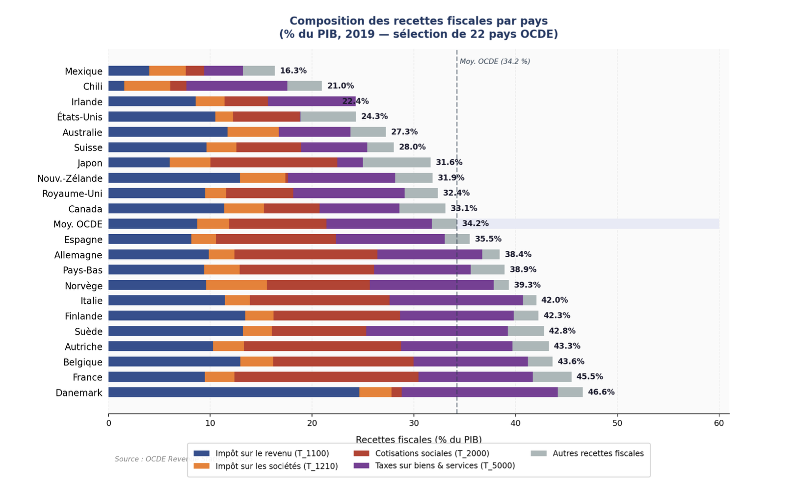
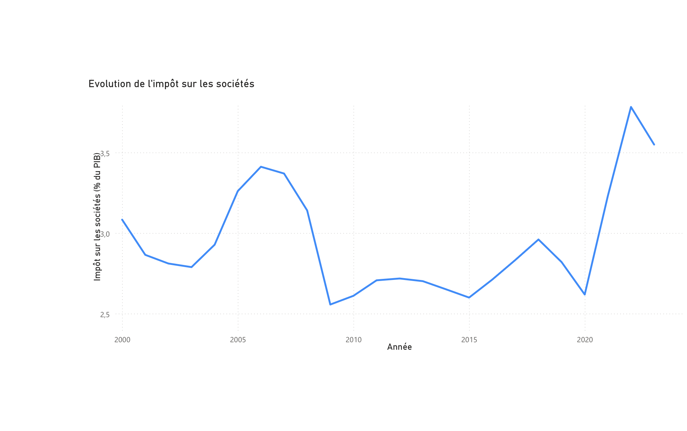
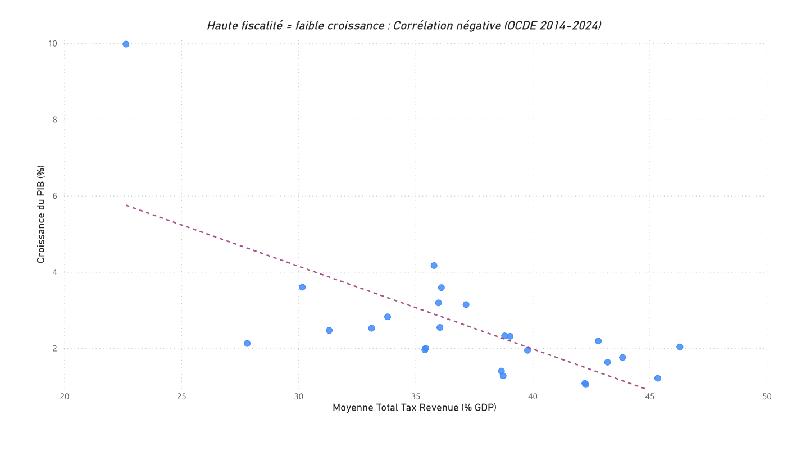
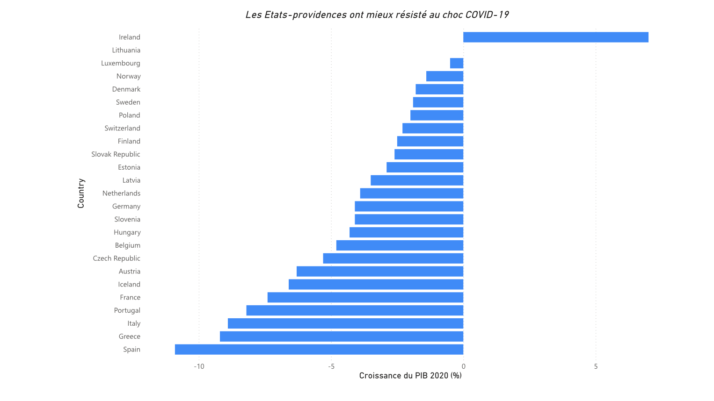

# Analyse et visualisation des recettes fiscales des pays de l'OCDE

> Étude comparative des systèmes fiscaux des pays de l'OCDE à partir de **trois sources internationales** (OCDE, Eurostat, FMI), avec un tableau de bord **Power BI** — et une réflexion sur la manière dont le *cadrage* des données oriente les conclusions.

**Auteure :** Divine Etongo Dikinz Kama · [LinkedIn](https://www.linkedin.com/in/divine-edk)
**Outils :** Power BI (Power Query, DAX), Excel · sources publiques OCDE / Eurostat / FMI

---

## 🎯 Objectif

Comparer la structure et l'évolution des recettes fiscales des pays de l'OCDE, et interroger la relation entre pression fiscale et croissance économique — dans un contexte marqué par l'accord OCDE/G20 sur l'impôt minimum mondial à 15 % (Pilier 2) et les tensions budgétaires post-COVID.

## 🗂️ Données (toutes publiques)

| Source | Contenu | Référence |
|---|---|---|
| **OCDE** | Recettes fiscales par catégorie, % du PIB | Revenue Statistics 2025 |
| **Eurostat** | Croissance du PIB | Série `tec00115` |
| **FMI** | Finances publiques (recoupement) | Government Finance Statistics 2024 |

Classification OCDE des recettes utilisée : `T_1100` impôt sur le revenu · `T_1210` impôt sur les sociétés · `T_2000` cotisations sociales · `T_4000` impôts sur la propriété · `T_5000` taxes sur les biens et services (TVA).

## 🔍 Démarche

Nettoyage, harmonisation et croisement des trois sources (méthodologies parfois divergentes) sur un échantillon de **22 à 25 pays de l'OCDE**. Année de référence **2019** (pré-COVID) pour la composition ; série longue **2000–2024** pour l'impôt sur les sociétés.

## 📊 Visualisations & résultats clés

### 1. Composition des recettes fiscales par pays (2019)


Fortes disparités : les pays nordiques (Danemark 46,6 %, France 45,5 %, Belgique 43,6 %) affichent les pressions fiscales les plus élevées, dominées par les cotisations sociales et la TVA. À l'opposé, le Mexique et le Chili (~16–21 %) ont des recettes limitées. L'Irlande se distingue par une structure atypique (pression totale faible ~23 %, mais IS non négligeable) — stratégie de compétitivité pour attirer les multinationales.

### 2. Évolution de l'impôt sur les sociétés (2000–2024)


Trois phases : hausse portée par la croissance (2000–2007), effondrement lors de la crise financière (2008–2009, ~2,6 % du PIB) puis nouveau point bas au choc COVID (2020), et **rebond spectaculaire depuis 2021** — rebond des bénéfices post-pandémie et premiers effets anticipatoires de l'accord sur le Pilier 2.

### 3. Fiscalité et croissance : une corrélation à manier avec prudence


Corrélation brute légèrement négative (25 pays européens de l'OCDE, 2014–2024). Trois mises en garde : la corrélation brute ne contrôle pas les effets fixes pays ; la causalité peut être inverse (les pays riches se permettent de taxer davantage) ; le PIB de certains pays (Irlande, Luxembourg) est distordu par les flux de multinationales.

### 4. Deux cadrages opposés sur les mêmes données

Le nuage de points ci-dessus (corrélation négative, 2014–2024) appuie la thèse « fiscalité élevée = croissance plus faible ». Mais la **même réalité**, cadrée autrement, dit l'inverse : en isolant le choc COVID de 2020, les États à haute fiscalité (Norvège, Danemark, Suède) ont mieux résisté grâce à leurs stabilisateurs automatiques.



Ni l'un ni l'autre cadrage n'est « faux » — ils posent des questions différentes. C'est tout l'enjeu du choix méthodologique.

## 🧭 Enseignement méthodologique

Une même réalité peut produire des récits opposés selon le cadrage retenu. C'est précisément pourquoi un analyste de données doit **expliciter ses choix méthodologiques, ses biais potentiels et les limites de ses conclusions** — le fil conducteur de ce projet.

## 📁 Structure du dépôt

```
oecd-tax-revenue-analysis/
├── README.md
├── 01_composition_2019.png
├── 02_evolution_is.png
├── 03_fiscalite_croissance.png
├── 04b_resilience_covid.png
├── oecd-tax-revenue.pbix       # tableau de bord Power BI
└── Rapport_Fiscal_OCDE.pdf     # rapport d'analyse complet
```

## ▶️ Explorer le projet

- 📄 **Rapport complet** : [`Rapport_Fiscal_OCDE.pdf`](Rapport_Fiscal_OCDE.pdf)
- 📊 **Tableau de bord Power BI** : `oecd-tax-revenue.pbix` (à ouvrir avec Power BI Desktop)
- 🔗 **Version interactive** : _(à ajouter — lien « Publier sur le web » de Power BI)_

## ⚠️ Limites

Corrélations brutes sans contrôle des effets fixes ; divergences méthodologiques entre sources (le FMI tend à rapporter des chiffres légèrement supérieurs pour les pays en développement) ; distorsion du PIB irlandais par les profits des multinationales (« Leprechaun economics », 2015).

## 👤 Auteure

**Divine Etongo Dikinz Kama** — M2 DADEE, Aix-Marseille School of Economics
[LinkedIn](https://www.linkedin.com/in/TON-IDENTIFIANT)

Deux visualisations construites à partir des **mêmes données**, aux conclusions opposées : l'une (tendance longue) suggère qu'une fiscalité élevée freine la croissance ; l'autre (coupe sur 2020) montre que les États à haute fiscalité ont mieux amorti le choc COVID grâce à leurs stabilisateurs automatiques. Ni l'une ni l'autre n'est « fausse » — elles posent des questions différentes.

## 🧭 Enseignement méthodologique

Une même réalité peut produire des récits opposés selon le cadrage retenu. C'est précisément pourquoi un analyste de données doit **expliciter ses choix méthodologiques, ses biais potentiels et les limites de ses conclusions** — le fil conducteur de ce projet.

## 📁 Structure du dépôt

```
oecd-tax-revenue-analysis/
├── README.md
├── data/            # données publiques (ou liens + codes de série)
├── dashboard/       # fichier Power BI (.pbix)
├── figures/         # les visualisations en PNG
└── report/          # le rapport d'analyse complet (PDF)
```

## ▶️ Explorer le projet

- 📄 **Rapport complet** : [`report/Rapport_Fiscal_OCDE.pdf`](report/Rapport_Fiscal_OCDE.pdf)
- 📊 **Tableau de bord Power BI** : `dashboard/oecd-tax-revenue.pbix` (à ouvrir avec Power BI Desktop)
- 🔗 **Version interactive** : _(à ajouter — lien « Publier sur le web » de Power BI)_

## ⚠️ Limites

Corrélations brutes sans contrôle des effets fixes ; divergences méthodologiques entre sources (le FMI tend à rapporter des chiffres légèrement supérieurs pour les pays en développement) ; distorsion du PIB irlandais par les profits des multinationales (« Leprechaun economics », 2015).

## 👤 Auteure

**Divine Etongo Dikinz Kama**
[LinkedIn](https://www.linkedin.com/in/divine-edk)
